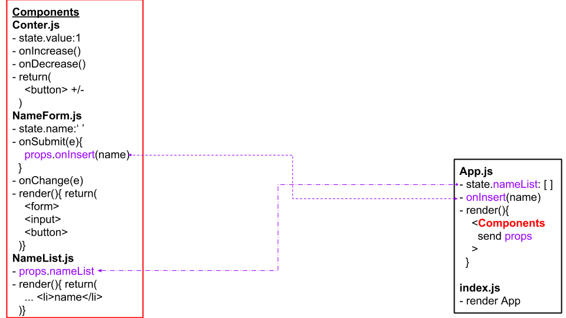
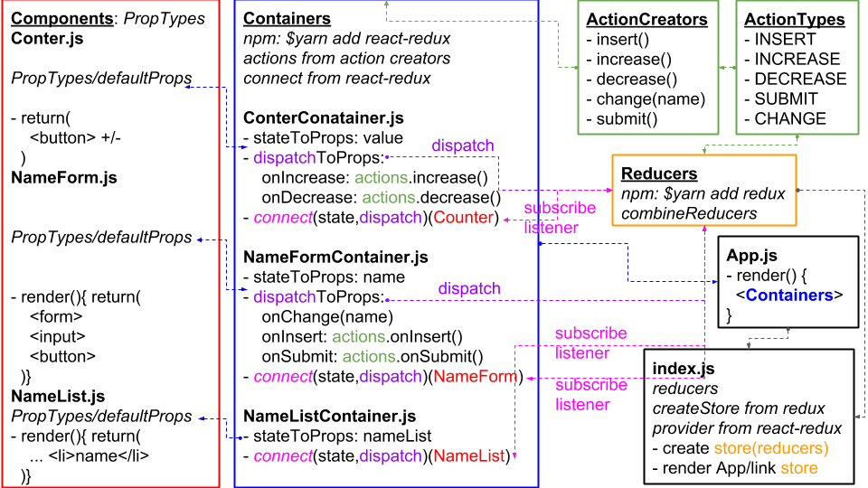
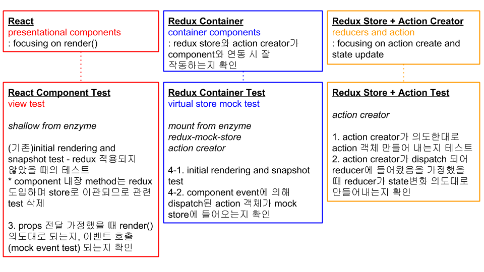

# React Component Unit Test
react component unit testing via 'Jest + react-test-renderer' and 'Jest + Enzyme'

## Test code basic structure
More test about [Jest expect](https://jestjs.io/docs/en/expect.html#expectvalue) 

  

## Run a test code
Set a file name: ComponentName.test.js 
Filtering test command: $yarn test ComponentName.test.js 
Whole test command: $yarn test

## Test sequence
1.component initial render test: about render() 
- initial rendering test 
- initial rendering snapshot matching test 

2.component function test

## [Enzyme?](https://airbnb.io/enzyme/docs/api/)
Can make react component test code which cannot make by react-test-renderer. 
- DOM event simulation test(ex. button click, input modify, form submit, etc).
- Find the string or props in DOM what you want to test.
- Confirm the LifeCycle of react is run, correctly.
- Snapshot test supported, also.
- Etc, specific component test. 

More on Enzyme
- Three type of rendering: Shallow, full, Static 
- wrapper.find(selector): [DOM node finding](https://airbnb.io/enzyme/docs/api/ShallowWrapper/find.html) 
- warpper.find(selector).simulate(event[,data]): [Mock test available](https://airbnb.io/enzyme/docs/api/ShallowWrapper/simulate.html) 

## Test code files
- Jest + react-test-renderer: Counter.test.js, NameList.test.js
- Jest + Enzyme: NameForm.test.js

## React stucture + Redux
Compare structure before apply Redux and after 

   
  React structure before apply Redux

 

   
  React structure after apply Redux

## Redux test with React Components
Apply redux test on react+redux

   
  React + Redux app test concept

## Reference
- Velopert 블로그 
1. [Jest, Enzyme을 통한 리액트 컴포넌트 유닛 테스팅](https://velopert.com/3587) 
2. [React + Redux 앱 테스트](https://velopert.com/3591) 
action type, action creator, reducer 통합된 store 만들기 참조 
axios 이용해 post component 만들기 참조 
- Simple test, Snapshot test - [react-test-renderer](https://reactjs.org/docs/test-renderer.html)
